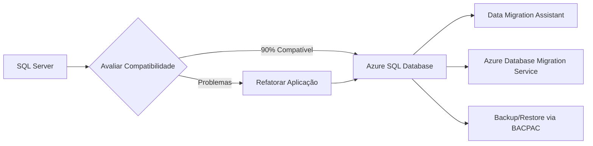
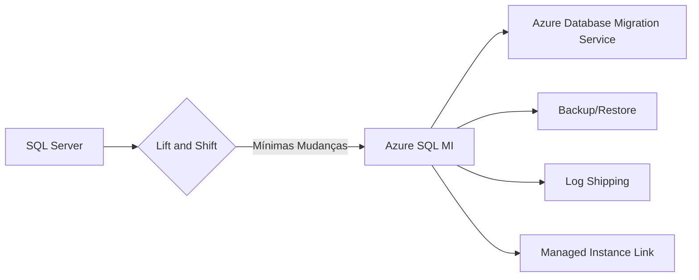

# Comparação: Azure SQL Database vs Managed Instance

Este documento apresenta uma comparação detalhada entre os dois principais serviços de banco de dados SQL do Azure.

## 📊 Visão Geral Comparativa

| Aspecto | Azure SQL Database | Azure SQL Managed Instance |
|---------|-------------------|----------------------------|
| **Modelo** | Database-as-a-Service | Instance-as-a-Service |
| **Compatibilidade SQL Server** | ~90% | ~99% |
| **Databases por serviço** | 1 database | Até 100 databases |
| **SQL Server Agent** | ❌ | ✅ |
| **Cross-database queries** | ❌ | ✅ |
| **Linked Servers** | ❌ | ✅ |
| **Tempo de criação** | Poucos minutos | 4-6 horas |
| **Isolamento de rede** | Firewall rules | VNet nativa |

## 🎯 Quando Usar Cada Serviço

### 🔹 Azure SQL Database - Ideal Para:

#### ✅ **Cenários Recomendados**
- **Aplicações novas** desenvolvidas para nuvem
- **Databases únicos** com requisitos específicos
- **Aplicações SaaS** com multi-tenancy
- **Prototipagem rápida** e desenvolvimento
- **Cargas de trabalho previsíveis** com escalabilidade automática

#### 💰 **Vantagens Econômicas**
```
✓ Modelo serverless disponível
✓ Escalabilidade automática
✓ Cobrança por database individual
✓ Opções de elastic pools
✓ Sem overhead de gestão de instância
```

#### 🚀 **Casos de Uso Típicos**
- E-commerce com databases por cliente
- APIs REST e microsserviços
- Aplicações web modernas
- Sistemas de analytics departamentais
- Aplicações móveis

### 🔹 Azure SQL Managed Instance - Ideal Para:

#### ✅ **Cenários Recomendados**
- **Migração lift-and-shift** de SQL Server
- **Aplicações legadas** com dependências específicas
- **Sistemas complexos** com múltiplos databases
- **Ambientes empresariais** com requisitos de compliance
- **Integração com ferramentas on-premises**

#### 🏢 **Vantagens Empresariais**
```
✓ Compatibilidade total com SQL Server
✓ SQL Server Agent nativo
✓ Cross-database operations
✓ Isolamento completo de rede
✓ Linked servers e CLR
```

#### 🚀 **Casos de Uso Típicos**
- Migração de data centers corporativos
- ERP e sistemas financeiros
- Data warehouses empresariais
- Aplicações com SQL Server Agent jobs
- Sistemas com stored procedures complexas

## 🏗️ Diferenças Arquiteturais

### 🔹 Azure SQL Database

```
┌─────────────────────────────────────┐
│           Azure SQL Database        │
├─────────────────────────────────────┤
│  ┌─────────┐ ┌─────────┐ ┌─────────┐│
│  │ Database│ │ Database│ │ Database││
│  │    A    │ │    B    │ │    C    ││
│  └─────────┘ └─────────┘ └─────────┘│
│                                     │
│  • Cada DB é independente           │
│  • Recursos dedicados por DB        │
│  • Escalabilidade individual        │
└─────────────────────────────────────┘
```

### 🔹 Azure SQL Managed Instance

```
┌─────────────────────────────────────┐
│      Azure SQL Managed Instance     │
├─────────────────────────────────────┤
│  ┌─────────────────────────────────┐ │
│  │        SQL Instance             │ │
│  │  ┌─────┐ ┌─────┐ ┌─────┐ ┌─────┐│ │
│  │  │ DB1 │ │ DB2 │ │ DB3 │ │ DB4 ││ │
│  │  └─────┘ └─────┘ └─────┘ └─────┘│ │
│  │                                 │ │
│  │  • Recursos compartilhados      │ │
│  │  • Cross-database queries       │ │
│  │  • SQL Server Agent             │ │
│  └─────────────────────────────────┘ │
└─────────────────────────────────────┘
```

## 🛠️ Comparação de Recursos Técnicos

### 📊 Recursos de Banco de Dados

| Recurso | SQL Database | Managed Instance |
|---------|--------------|------------------|
| **T-SQL Support** | Limitado | Quase completo |
| **Stored Procedures** | ✅ | ✅ |
| **Functions** | ✅ | ✅ |
| **Triggers** | ✅ | ✅ |
| **Views** | ✅ | ✅ |
| **Indexes** | ✅ | ✅ |
| **Partitioning** | ✅ | ✅ |
| **Temporal Tables** | ✅ | ✅ |
| **JSON Support** | ✅ | ✅ |
| **XML Support** | ✅ | ✅ |

### 🔧 Recursos Administrativos

| Recurso | SQL Database | Managed Instance |
|---------|--------------|------------------|
| **SQL Server Agent** | ❌ | ✅ |
| **Database Mail** | ❌ | ✅ |
| **Linked Servers** | ❌ | ✅ |
| **Cross-DB Queries** | ❌ (Elastic Query) | ✅ |
| **CLR Integration** | ❌ | ✅ |
| **Service Broker** | ❌ | ✅ |
| **SSIS** | ❌ | ✅ (via Azure) |
| **Backup/Restore** | Automatizado | ✅ + Manual |
| **Point-in-time Recovery** | ✅ | ✅ |

### 🌐 Conectividade e Rede

| Aspecto | SQL Database | Managed Instance |
|---------|--------------|------------------|
| **Endpoint Público** | ✅ (Padrão) | ✅ (Opcional) |
| **VNet Integration** | ❌ (Private Link) | ✅ (Nativo) |
| **Firewall Rules** | IP-based | NSG + Route Table |
| **Private Endpoints** | ✅ | ✅ |
| **Connection Types** | Proxy/Redirect | Proxy/Redirect |
| **Default Port** | 1433 | 1433 (VNet) / 3342 (Public) |

## 💰 Comparação de Custos

### 🔹 Azure SQL Database

#### **Modelo DTU (Database Transaction Unit)**
```
Basic:    $5-15/mês    (5-100 DTUs)
Standard: $15-750/mês  (10-800 DTUs)  
Premium:  $465-7k/mês  (125-4000 DTUs)
```

#### **Modelo vCore**
```
General Purpose: $0.12-7.2/hora  (1-80 vCores)
Business Critical: $0.29-17.4/hora (1-80 vCores)
Hyperscale: $0.17-13.6/hora (1-80 vCores)
```

#### **Modelo Serverless** (Somente vCore)
```
Auto-pause: Cobrança apenas por storage
Auto-scale: Baseado em uso real
Ideal para: Dev/Test e cargas intermitentes
```

### 🔹 Azure SQL Managed Instance

#### **Modelo vCore (Único modelo)**
```
General Purpose: $0.42-25.5/hora    (4-80 vCores)
Business Critical: $1.02-61.2/hora  (4-80 vCores)

Mínimo: 4 vCores (não há opção menor)
Storage: 32GB-16TB (GP) / 32GB-4TB (BC)
```

#### **Benefício Híbrido do Azure**
```
Economia: Até 55% para quem tem Software Assurance
Aplicável: Tanto para SQL Database quanto Managed Instance
Flexibilidade: Pode alternar quando necessário
```

## 📈 Comparação de Performance

### 🔹 SQL Database - Características

**Escalabilidade**
- ✅ **Horizontal**: Elastic Pools
- ✅ **Vertical**: Auto-scaling (Serverless)
- ✅ **Read Replicas**: Geo-replication
- ✅ **Sharding**: Elastic Database Tools

**Limitações**
- ❌ Recursos compartilhados em DTU
- ❌ Sem controle de instância
- ❌ Dependente de camada de serviço

### 🔹 Managed Instance - Características

**Recursos Dedicados**
- ✅ **Instância completa**: Recursos não compartilhados
- ✅ **Controle total**: Configurações de instância
- ✅ **Performance previsível**: SLA garantido

**Escalabilidade**
- ✅ **Vertical**: Alterar vCores/Storage
- ✅ **Failover Groups**: Alta disponibilidade
- ❌ **Auto-scaling limitado**: Manual ou via automation

## 🔄 Cenários de Migração

### 🔹 SQL Server → SQL Database



**Ferramentas Recomendadas:**
- Azure Database Migration Service
- Data Migration Assistant (DMA)
- SQL Server Migration Assistant (SSMA)
- Transact-SQL commands

### 🔹 SQL Server → Managed Instance



**Ferramentas Recomendadas:**
- Azure Database Migration Service (Recomendado)
- Native backup/restore
- Log shipping
- Managed Instance Link (SQL 2016+)

## 🎯 Matriz de Decisão

### 📋 Checklist para Escolha

#### ✅ **Escolha SQL Database se:**
- [ ] Aplicação nova ou modernizada
- [ ] Apenas 1 database necessário
- [ ] Não usa SQL Server Agent
- [ ] Não tem cross-database queries
- [ ] Precisa de auto-scaling
- [ ] Orçamento mais restrito
- [ ] Tempo de implementação é crítico

#### ✅ **Escolha Managed Instance se:**
- [ ] Migração de SQL Server existente
- [ ] Múltiplos databases relacionados
- [ ] Usa SQL Server Agent extensivamente
- [ ] Tem cross-database queries
- [ ] Usa Linked Servers
- [ ] Integração com sistemas on-premises
- [ ] Requisitos de compliance de rede
- [ ] Aplicações legadas complexas

## 🔗 Recursos Adicionais

### 📚 Documentação Oficial
- [Escolher a opção certa](https://docs.microsoft.com/azure/azure-sql/azure-sql-iaas-vs-paas-what-is-overview)
- [Guia de migração](https://docs.microsoft.com/data-migration/)
- [Comparação detalhada de recursos](https://docs.microsoft.com/azure/azure-sql/database/features-comparison)

### 🛠️ Ferramentas de Avaliação
- [Azure Migrate](https://azure.microsoft.com/services/azure-migrate/)
- [Data Migration Assistant](https://www.microsoft.com/download/details.aspx?id=53595)
- [Database Migration Service](https://azure.microsoft.com/services/database-migration/)

## 🚀 Próximos Passos

1. 📖 [Conceitos Básicos](./01-conceitos-basicos.md)
2. 🏗️ [Camadas de Serviço](./03-camadas-servico.md)
3. 🛠️ [Tutorial Prático](../passo-a-passo/01-criando-instancia.md)

---
📅 **Última atualização**: Junho 2025  
⬅️ [Voltar ao Índice](../README.md) | ➡️ [Próximo: Camadas de Serviço](./03-camadas-servico.md)